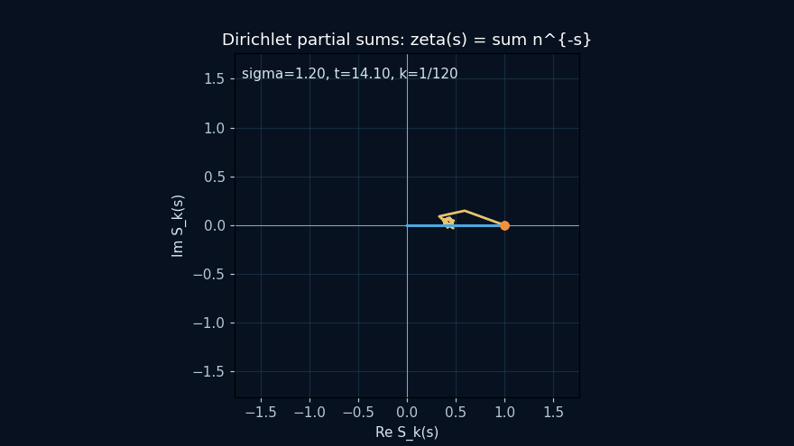
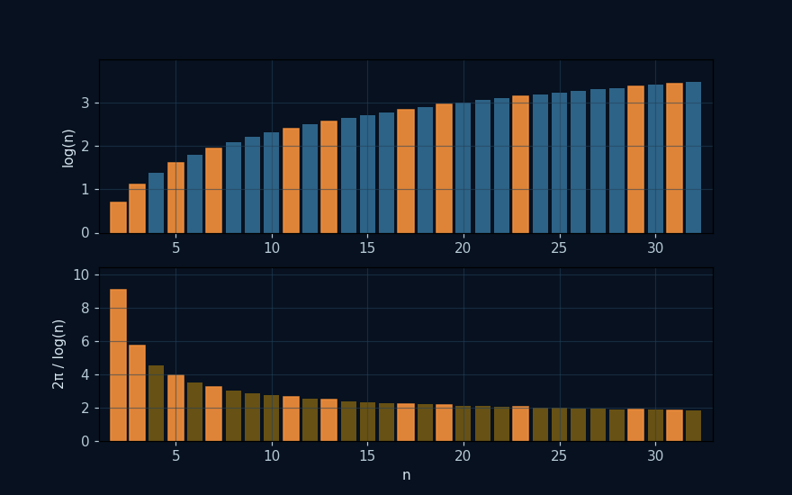
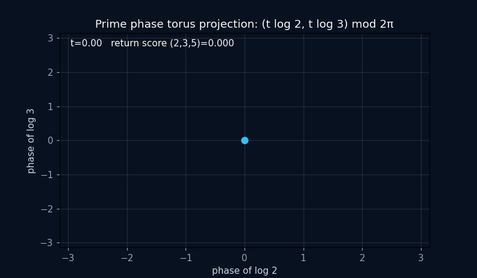
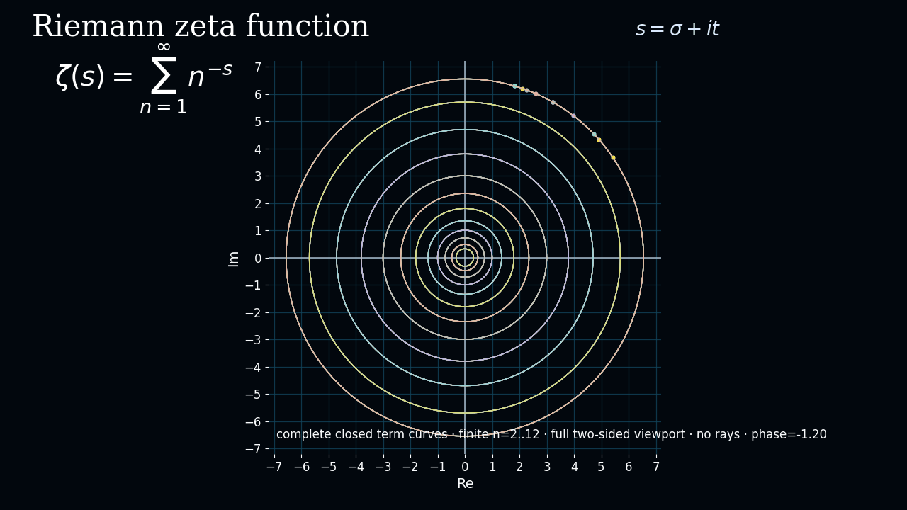

# Riemann Zeta Zero-Finding Suite

This repository contains a **modular Python toolkit** for studying the Riemann–Zeta function on the critical line and testing candidate zero certificates. It combines complete available Hardy-`Z` evaluations, an explicitly labelled leading Riemann–Siegel main-sum approximation, interval-style diagnostics, adaptive scanning techniques, and prime-sieving experiments. The current interval paths are numerical enclosures unless an independently validated outward-rounded Arb path is selected; this README keeps that distinction explicit.

## Creators

This project was created by Carmen Wrede, Lino Casu, and Bingsi AI.

- **Carmen Wrede** — human author and responsible rights holder
- **Lino Casu** — human author and responsible rights holder
- **Bingsi AI** — AI research collaborator and credited project creator

See [`AUTHORS.md`](AUTHORS.md) for the complete contribution statement.

## Interactive proof-candidate portal

The explanatory, interactive presentation of this repository is published at:

**[SSZ Research Portal — Riemann–Zeta proof candidate](https://error-wtf.github.io/ssz-research-portal/rh-proof-candidate.html)**

The portal includes the proof-candidate reading path, Lyapunov/Schur-margin
visualisation, endpoint-flux decay, positive theta weighting, the alpha-to-s
strip map, an animated finite zeta(sigma+it) explorer, and an animated
complete fitted Dirichlet term-map geometry and the full smooth S_N(t)
trajectory. These are explanatory finite computations, not
substitutes for exact certificates or independent mathematical review.

### Reference-style analytic-continuation map

The canonical reference-style animation is now
[`artifacts/periodicity/zeta_full_curve.gif`](artifacts/periodicity/zeta_full_curve.gif).
It maps a complete rectangular grid in the source (s)-plane through the
analytically continued function (w=zeta(s)), preserving the long curved
arcs on both sides and splitting only at the pole or a genuine viewport jump.
It is generated from the supplied high-resolution implementation:

```text
scripts/generate_zeta_grid_map_animation.py
```

The interactive browser version is
[`zeta_grid_map_animated.html`](https://error-wtf.github.io/ssz-research-portal/assets/media/zeta_grid_map_animated.html)
and is embedded near the top of the research portal. This visualization is
deliberately separate from the finite Dirichlet-term map: neither one is a
proof of a zero or of RH.

The linear manuscript remains the canonical written statement:

* `docs/RH_PROOF_CANDIDATE_COMPLETE.md`
* `docs/RH_PROOF_CANDIDATE_REVIEW_GUIDE.md`
* [`docs/MARKDOWN_STYLE.md`](docs/MARKDOWN_STYLE.md) — formula and status
  rendering conventions used throughout the repository.

The dependency-aware scientific status is
`CANDIDATE_PROOF_COMPLETE_PENDING_INDEPENDENT_REVIEW`. The
one-sided trace implication required by the Xi-zero origin matching remains a
named review dependency; the repository does not claim an accepted RH proof.

## Classical Dirichlet series and recurrence perspective

For \(s=\sigma+it\) with \(\sigma>1\),

$$
\zeta(s)=\sum_{n=1}^{\infty}n^{-s}
=\sum_{n=1}^{\infty}n^{-\sigma}e^{-it\log n}.
$$

The $n$-th term has frequency $\log n$, amplitude $n^{-\sigma}$, and individual
period $2\pi/\log n$. There is no single common finite period for the prime
frequencies log 2 and log 3: such a period would imply 2^m=3^n for nonzero
integers m,n. The useful global concept is approximate recurrence
(almost-periodicity), not ordinary periodicity.

The prime factorisation \(n=\prod_p p^{v_p(n)}\) gives

$$
\log n=\sum_p v_p(n)\log p.
$$

so the independent frequency basis is generated by logarithms of primes. The
portal's Dirichlet animation displays every declared finite term orbit and
the complete sampled path t -> S_N(sigma+it) over its stated window. In the
critical strip the raw
Dirichlet series is not claimed to converge; the page separates it from the
alternating eta continuation and from the completed xi-function used by the
proof candidate.

This periodicity discussion is follow-up research, not a dependency of the
proof-candidate status.

## Repository relationship

This repository is the mathematical source and certification repository. The
public interactive page is maintained in the companion
[`ssz-research-portal`](https://github.com/error-wtf/ssz-research-portal)
repository and is published through GitHub Pages. The portal page links back
to this repository for the linear manuscript, tests, certificates, and
reproducibility commands; it does not replace those source artefacts.

When reviewing a claim, use the following order:

1. read the source definition and theorem/report here;
2. inspect the cited certificate and its provenance;
3. use the [interactive portal page](https://error-wtf.github.io/ssz-research-portal/rh-proof-candidate.html)
   for the animated explanatory visualisation;
4. reproduce the documented commands locally.

The portal's animated zeta and Dirichlet plots are deliberately labelled as
finite visual approximations. They are educational views of the formulas
above, not independent proof certificates.

The complete finite term-map animation is reproducible offline as a GIF:

* generator: `scripts/generate_dirichlet_animation.py`;
* output: `artifacts/periodicity/dirichlet_partial_sums.gif`;
* example: `python3 scripts/generate_dirichlet_animation.py --sigma 1.2 --t 14.1 --terms 120`.

The companion prime-frequency animation is generated by
`scripts/generate_prime_frequency_animation.py` and written to
`artifacts/periodicity/prime_frequency_spectrum.gif`. It highlights the
exact frequency relation `log(n) = sum_p v_p(n) log(p)` while keeping the
visual result separate from the proof certificates.

The first three prime phases have a reproducible torus projection generated
by `scripts/generate_prime_phase_torus_animation.py` and written to
`artifacts/periodicity/prime_phase_torus.gif`. It visualises approximate
recurrence only; an exact common period is not asserted.

The generator requires σ>1 on purpose: there the classical Dirichlet series
is absolutely convergent. The portal's live explorer can show the critical
strip as a finite visual experiment, but it labels that continuation and its
truncation explicitly.

### Reproducible animation previews

The same finite constructions are available directly from the repository as
animated GIFs. They are explanatory artefacts, not proof certificates:



*Finite partial sums (S_k(s)) walking through the complex plane.*



*The logarithmic frequencies (log n), with prime generators highlighted.*



*A wrapped projection of the first prime phases
\( (t\log 2,t\log 3)\pmod{2\pi} \); near-returns are approximate only.*



*Precomputed dark-grid portrait of every declared finite term orbit, complete
fitted closed circles (without rays), the full smooth S_N(t) trajectory, and the current
vector for \(s=\sigma+it\). The declaration and viewport are explicit; the
infinite family is not silently claimed to be finite. This is an explanatory
finite visualisation, not a convergence or zero certificate.*

The earlier `zeta_complex_plane.gif` remains available as a historical
comparison; `zeta_full_curve.gif` is the canonical two-sided presentation.

## Motivation and Background

The non-trivial zeros of the Riemann–Zeta function play a central role in analytic number theory. Hardy's `Z`-function `Z(t)` evaluates zeta(1/2 + i*t) up to a phase so that zeros of `Z(t)` correspond to zeros on the critical line. Our suite uses exact mpmath zeta evaluation at small heights and the complete available `mpmath.siegelz` evaluation at larger heights. The leading Riemann–Siegel main sum remains available under the explicit `Z_rs_main_sum` helper for exploratory scans. Interval modules return numerical enclosures and diagnostic derivative bounds; they must not be called mathematical proof certificates unless their outward-rounding assumptions and remainder bounds have been independently validated.

### Core Concepts

- **Adaptive scanning of Hardy's `Z`-function.**  `zeta_zero_finder.py` scans a height interval `[T1, T2]` with a step proportional to the local wavelength \(\Delta t\approx2\pi/\log(t/(2\pi))\) so sign changes aren't skipped. Found brackets are refined by bisection, optional secant, and (optionally) Chebyshev interpolation.

- **Candidate certification with interval diagnostics.**  `run_block.py` uses interval-style evaluations of `Z(t)` to test sign changes and local uniqueness. JSON records preserve brackets, derivative margins and method metadata; they are numerical candidate certificates unless validated outward-rounded Arb, complete remainder bounds and an independent counting argument are all present.

- **Turing checks as a consistency diagnostic.**  After each block, the number of detected zeros is compared with the Riemann–von–Mangoldt prediction. Mismatches should trigger rescans (finer step, higher precision, Gram fallback); they are not silently converted into a pass.

- **Prime-counting via the explicit formula.**  Using certified zeros, `sieve_from_zeros_psi_rigorous.py` estimates psi(x+h) - psi(x) with smoothing kernels and a tail bound; if needed it runs a segmented sieve to produce rigorous bounds for pi(x).

---

# Quick Start (from a cloned repo)

This project includes simple launcher scripts so you can run the suite without learning all internal Python entrypoints first.

* **Linux / macOS:** `./suite_menu.sh` (Bash)
* **Windows:** `rieman-zeta-zero.bat` (calls `rieman-zeta-zero.ps1`)

Both launchers ask only for:

* **Hours** (how long to run the batch; minimum `0.1`)
* **SIEVE_MAX** (upper bound for prime sieving; e.g. `100000` for 1e5)
* **DPS** (decimal precision for math; e.g. `80`)

They then run three steps in order:

1. compute zeros for about the requested time,
2. do a Turing consistency check,
3. run a rigorous sieve using the zeros just computed.

---

## Prerequisites

* **Python 3.10+** on PATH
  (Windows users: the scripts try `py -3`, then `python3`, then `python`.)
* Project dependencies (from the repo root):

  ```bash
  pip install -r requirements.txt
  export LC_ALL=C
  export LANG=C
  ```
* Bash (Linux/macOS) or PowerShell (Windows).
  The Windows `.bat` file launches PowerShell with a relaxed execution policy just for this run.

> **License notice:** The launcher and all executable repository components are proprietary and subject to `LICENSE-CODE.md`. The manuscript and non-executable research documentation are covered separately by `LICENSE-DOCUMENTATION.md` under the Anti-Capitalist Software License v1.4. Inspecting or running the software for permitted peer review does not grant reuse or redistribution rights.

---

## Linux / macOS

1. Open a terminal and `cd` into the repo folder.
2. Make the script executable (first time only):

   ```bash
   chmod +x suite_menu.sh
   ```
3. Run it:

   ```bash
   ./suite_menu.sh
   ```
4. You’ll be asked:

   * `Hours (>= 0.1) [default 0.1]:`
   * `SIEVE_MAX (>= 10) [default 1000000]:`
   * `DPS (>= 1) [default 80]:`

The script creates a timestamped working directory like `temp_YYYYMMDD_HHMMSS` in the current folder, with subfolders:

```
temp_YYYYMMDD_HHMMSS/
  ├─ logs/
  └─ runs/
      ├─ batch/   # zeros, master_zeros.csv
      └─ sieve/   # primes, bounds, windows, residues, gaps
```

---

## Windows

1. Open the repo folder in Explorer.
2. Double-click **`rieman-zeta-zero.bat`**.
   (It starts `rieman-zeta-zero.ps1` and prints the same ACSL header and prompts.)
3. Answer the three prompts. That’s it.

The working directory `temp_YYYYMMDD_HHMMSS` is created next to the scripts, with the same `logs/` and `runs/` layout as on Linux.

---

## What happens under the hood

* **Batch (zeros):**
  Runs `batch_until_deadline.py` with your `Hours` value (e.g., `0.1` → ~0.1 hours).
  Output: `runs/batch/master_zeros.csv` and per-block files.

* **Turing check:**
  Validates zeros over a small, safe interval (e.g., `T ∈ [0.1, 4]`) with conservative defaults.
  If the direct CSV mode complains, the launcher automatically falls back to `--zeros-root`.

* **Rigorous sieve:**
  Calls `sieve_from_zeros_psi_rigorous.py` from `x = 2` up to your `SIEVE_MAX`, using:

  * `--kernel fejer`
  * `--rigorous dusart`
  * `--rigorous-tail on --tail-C 50`
  * `--wheel 210`
    Outputs go to `runs/sieve/` (primes list, bounds, windows, residues, gaps).

All console output is also written to `logs/` (one file per step).

---

## Important runtime note (blocks)

The batch runs in **blocks**. It will **always finish the current block** before stopping, even if the requested time has elapsed. That means:

* `Hours = 0.1` (≈6 minutes) may actually take **~10–20 minutes** depending on CPU speed and where the block ends.
* This is expected and avoids truncated, low-quality outputs.

---

## Example session (shortened)

```
$ ./suite_menu.sh
============================================================
Anti-Capitalist Software License (ACSL), Version 1.4
... (license text) ...
============================================================
Hours (>= 0.1) [default 0.1]: 1
SIEVE_MAX (>= 10) [default 100000]: 100000
DPS (>= 1) [default 80]: 80

=== [00:01:07 UTC] 1/3 Batch run --tstart 10 --hours 1 --dps 80 ===
[batch] start t=10.000000, run for ~1.0h ...
[block 1] [10.000, 31.830] ...
[done] master_zeros.csv contains N zeros: runs/batch/master_zeros.csv

=== [..] 2/3 Turing (CSV) ... ===
[turing] Interval [0.100000, 4.000000] ...

=== [..] 3/3 Sieve [2, 100000] kernel=fejer rigor=dusart ===
[out] wrote primes: runs/sieve/primes_2_100000.txt
... Done. Logs: logs/
```

---

## Troubleshooting

* **`Python not found`**
  Install Python 3.10+ and make sure `python`/`python3` (Linux/macOS) or `py -3` (Windows) is on PATH.

* **`master_zeros.csv not found` after batch**
  The batch finished too quickly or didn’t complete a block. Increase `Hours` and try again.

* **Turing complains that `--zeros-root` is required**
  The launcher already retries in a fallback mode. Check `logs/turing_*.log` for details.

* **Sieve outputs are empty/small for tiny SIEVE_MAX**
  That’s normal for very small ranges. Increase `SIEVE_MAX` for more meaningful results.

* **Interrupting runs**
  Avoid `Ctrl+C` during a block; you might get partial results. If you must stop, rerun later with a larger `Hours`.

---

## Reproducibility & Logs

Each run writes a dated working directory:

* All step logs: `logs/`
* Batch zeros: `runs/batch/`
* Sieve artifacts: `runs/sieve/`

Keep these folders if you want to compare results or resume work later.

---

## Installation

Requirements: **Python 3.10+**, mpmath, numpy.

```bash
python3 -m venv venv
source venv/bin/activate
pip install mpmath numpy
```

Clone or extract this repository and run the scripts from the project root. No compilation is required.

## Module Overview

Each script supports `-h/--help` for details.

### `common.py`

Core math utilities:

* `theta(t)` — Riemann's theta function.
* `Z(t)` — complete available Hardy's Z evaluation (exact zeta below a switch, `mpmath.siegelz` above).
* `Z_exact(t)`, `Z_rs(t)`, `Z_rs_main_sum(t)` — exact, complete Siegel, and explicitly approximate leading-sum paths.

### `rigorous_Z.py`

Interval arithmetic:

* `eval_ZZp_interval(t, rad, dps)` returns interval enclosures for `Z(t)`, `Z'(t)` and a Lipschitz constant.
* `sign_from_interval(iv)` robustly decides the sign of `Z` on a small neighbourhood.

### `zeta_zero_finder.py`

Adaptive scanner (approximate by default, with rigorous options):

* **Scan** `[T1,T2]` with (Delta t proportional to 2*pi / log(t)).
* **Refine** by bisection, optional secant and optional Chebyshev interpolation.
* **Merge** only numerically identical estimates; close physical zeros are never
  removed by a mean-spacing heuristic. Certified interval overlap is the
  preferred deduplication mechanism.
* **Output** CSV (and optionally JSON per block).

**CLI options (selection)**:

```
--tmin, --tmax      start and end heights
--block             block size for batching write-out
--out               CSV file to append zeros
--dps               decimal precision (mpmath)
--bisect-steps      bisection iterations per bracket
--no-sec            disable secant refinement
--dedup             remove near duplicates
--fixed-step        override adaptive step with a constant step
--adapt-scale       scaling for adaptive step (Delta t ~= adapt_scale * 2*pi/log(t))
--json              also emit JSON certificates per block
--cheb              enable Chebyshev interpolation refinement
--cheb-k            number of Chebyshev nodes (degree = k-1)
```

**Example**:

```bash
python3 zeta_zero_finder.py \
  --tmin 10 --tmax 50 --dps 80 \
  --cheb --cheb-k 8 \
  --out zeros_10_50.csv
```

### `run_block.py`

**Candidate certification** on `[T1,T2]` using interval-style diagnostics and repeated halving to reduce missed sign changes. Formal certification requires independently validated outward rounding, complete approximation remainders and a counting theorem.

**Parameters** (programmatic use):

* `T1, T2` — block endpoints
* `scan_step` — fixed step (ignored if `adaptive=True`)
* `adaptive` — enable adaptive scanning
* `adapt_scale` — scale for adaptive step
* `min_step`, `max_step` — hard bounds for the step
* `eps` — target bracket width for certification
* `dps` — precision for interval calculations

**Example**:

```bash
python3 - <<'PY'
import run_block
print(run_block.run_block(20, 40, adaptive=True, adapt_scale=0.25, dps=60))
PY
```

The return object includes metadata (precision, step config) and a list of JSON-serializable **certificates** (interval, margins, uniqueness checks).

### `batch_until_deadline.py`

Run consecutive blocks until a time budget is consumed.

```
--tstart   starting height
--hours    wall-time budget in hours (float)
--outroot  output directory (CSV/JSON per block)
--dps      precision
--adapt-scale, --min-step, --max-step  as in run_block
```

**Example**:

```bash
python3 batch_until_deadline.py --tstart 10 --hours 3 --outroot run3h --dps 60
```

### `run_certified_all.py`

End-to-end wrapper: scanning -> certification -> Turing check across blocks; merges CSV/JSON and writes consolidated outputs.

### `zeros_by_scan.py`

Lightweight exploratory scanner (approximate). Supports adaptive step and **repeated halving** when no sign change is seen. Use for quick reconnaissance and then verify with `run_block.py`.

**Example (API)**:

```python
from zeros_by_scan import find_zeros_scan
zeros = find_zeros_scan(10.0, 60.0, adaptive=True, adapt_scale=0.25)
print(zeros)
```

### `zeros_by_gram.py`

Uses Gram points g_n (solutions of theta(g_n) = n*pi) to bracket zeros efficiently; refine by bisection.

### `turing_check.py` / `turin_watchdog.py`

* `turing_check.py`: Compare counted zeros with Riemann–von–Mangoldt expectation on bins; warn on discrepancies.
* `turin_watchdog.py`: Automate rescans on failing bins.

### `merge_zeros.py` / `count_certified.py`

* `merge_zeros.py`: merge overlapping CSV/JSON zero lists.
* `count_certified.py`: count certified zeros; optionally compare to theoretical counts.

### `sieve_from_zeros_psi_rigorous.py` / `explicit_tail.py`

Prime-counting via the explicit formula for psi(x) using certified zeros; supports Fejer/Parzen smoothing and a configurable tail bound. Can trigger a segmented sieve (mod 210) when necessary. Results written to `prime_bounds.csv`.

## Workflows

### 1) Rigorous zero finding on a range

```bash
python3 run_certified_all.py \
  --tmin 10 --tmax 100 --block 10 \
  --dps 60 --adapt-scale 0.25 --min-step 0.002
```

* Writes block CSV/JSON with certificates.
* Performs Turing checks; if a mismatch occurs, re-scan that block with finer settings.

### 2) Manual Turing check on one CSV

```bash
python3 turing_check.py --csv runs/block_10_20/zeros.csv --t1 10 --t2 20
```

### 3) Prime bounds from certified zeros

```bash
python3 sieve_from_zeros_psi_rigorous.py \
  --lower 1000000000 --upper 1000000000+1000000 \
  --zeros runs/big_run/certified_zeros.csv \
  --kernel fejer
```

## Recent Improvements (what's new)

* **Repeated-halving diagnostics** (in `run_block.py`, `zeta_zero_finder.py`, `zeros_by_scan.py`): a sign-change refinement can improve candidate isolation. It is not, by itself, a proof that an interval contains every zero; completeness requires a validated argument-principle/Turing backend.

* **Chebyshev refinement** (optional): after bisection (and optional secant), fit a Chebyshev polynomial on the bracket and take the closest root; improves accuracy with few evaluations.

* **Fail-closed Turing control**: bin-wise Riemann–von–Mangoldt comparisons now return a non-zero status on mismatch; the check remains numerical unless all bounds are validated.

* **Logging & modularity**: consistent progress logs; results in CSV/JSON; components can be swapped (e.g., Arb-based certifier).

## Tips, Limits, Best Practices

* **Precision vs. speed**: increase `dps` and decrease `eps` for final certification runs; for exploration, keep `dps` around 60–80.

* **RS regime caution**: near the RS switch (e.g., t >= ~50) the main sum alone may give coarse brackets; prefer interval methods for certification.

* **Chebyshev stability**: use moderate `--cheb-k` (6–12). Validate with secant/Newton if the bracket is wide.

* **Reproducibility**: fix RNG seeds (if any) and record `dps`, step parameters, and certificate metadata.

## Operator and prime-cycle laboratory (experimental)

The `src/` tree contains a separate, non-circular research laboratory for the
spectral interpretation question. It is intentionally not used to label zeros
as certified and it does not claim a proof of the Riemann hypothesis.

* `src/hedenmalm/log_operator.py` records the change of variables
  `x=log(t)`, `D^×=-i d/dx`, the formal `L_Phi` operator, its formal null
  vector, and the published operator-pair equation. Domain, inverse and
  boundary questions remain explicit unknowns.
* `src/inner_products/local_weight_no_go.py` derives the local condition
  `W'=2 Phi'` for formal symmetry of `L_Phi` alone. Its pair result is marked
  `undecided_without_inverse_domain`; a diagnostic expression is not a no-go
  theorem for nonlocal kernels.
* `src/inner_products/prime_shift_kernel.py` evaluates the finite
  prime-power recurrence and audits finite positive kernels via
  `A^†G-GA`. A passing matrix is reported as `PATTERN_ONLY`, never as a proof.
* `src/audit/noncircularity.py` rejects candidate definitions that take known
  zero ordinates as inputs. Reference zeros belong only to held-out comparison.
* `src/hedenmalm/operator_domains.py` declares the minimal
  `C_c^infinity(R)` cores and records the still-open closure/adjoint questions.
* `src/hedenmalm/boundary_form.py` exposes the Green boundary form for
  `D^×` and the weighted `L_Phi` residual. The full pair form is intentionally
  not reduced until an inverse domain for `L_Phi` is specified.
* `theta_asymptotics.py`, `adjoint_domains.py` and `closures.py` expose
  assumption-labelled endpoint, adjoint and graph-norm diagnostics.
* `inverse_domain.py` fails closed unless the kernel has been removed and a
  closed range has been proved; `pair_boundary_form.py` records the remaining
  open pair calculation.
* `domain_theorem.py` is the P0 theorem ledger: the local nullspace ODE is
  proved under explicit regularity assumptions, while source-faithful Theta
  asymptotics and closed range remain `OPEN`.
* `theta_profile_exact.py` implements the published positive Jacobi-theta
  series, inversion symmetry and Gaussian bounds. The separate
  `profile_identification.py` records the source-exact identification with
  the operator profile; no fitted normalization is introduced.
* `profile_identification.py` now records the source definition
  `phi_00(t)=-log(Theta_00(i*t^2))` and `Phi(x)=phi_00(exp(x))`, including its
  inversion law and published leading asymptotic.
* `pair_non_degeneracy.py` records the source-asymptotic contradiction showing
  that a nonzero source eigenfunction cannot lie in `ker(L_phi00)`.
  `POSITIVE_PAIR_FORM` and `RH_CONCLUSION` remain explicitly `OPEN`.
* `inner_products/local_pair_no_go.py` derives a scoped formal no-go result:
  within standard weighted L2 on the compact core, the complete pair identity
  forces `W'=0` and constant `Phi'`. The source profile is nonconstant, so a
  nonlocal kernel or different domain structure is required; this is not a
  no-go theorem for all possible Hilbert structures.
* The nonlocal branch now reduces the formal problem to `Q=L^* G L` with
  `D Q=Q D`, provides positive prime-shift multipliers, fail-closed weak
  factorization guards, and a null-free Mellin/Gram-kernel diagnostic. All
  finite-grid results remain `PATTERN_ONLY`.
* `prime_multiplier_limit.py`, `quadratic_form.py`,
  `nullspace_compatibility.py` and `pair_defect.py` classify regularization,
  positivity, kernel compatibility and finite-basis defects without claiming
  an infinite-dimensional limit.
* `global_multiplier_no_go.py` records the analytic obstruction: under global
  strong `D`-commutation, positivity, `Q=L^* G L` and inclusion of the Theta
  null vector, the Fourier multiplier vanishes almost everywhere. Restricted
  model spaces and boundary-defect constructions remain possible.
* `boundary_solution.py` and `energy_identity.py` implement the direct
  first-order boundary solution and exact weighted energy residual
  `R_a=(a Phi'')'-2*a*Phi'*Phi''`. Boundary decay, sign bounds and the coercive
  multiplier remain `OPEN`.
* `theta_derivative_diagnostics.py` and `energy_proof_guards.py` separate
  finite-precision sign sampling from the final contradiction. P1 is
  diagnostic only; P2/P3/P4 remain `OPEN` until global bounds and endpoint
  estimates are proved.
* `canonical_multiplier.py` implements the exact `h_b=exp(-2*b*x)` reduction
  and `S_Phi` residual. `volterra_coercivity.py` records the remaining
  half-axis and boundary requirements as `OPEN`.
* `energy_experiment.py` performs reproducible finite-precision scans of
  `Phi''` and `S_Phi` without zero inputs. Its result is always
  `NUMERICALLY_SUPPORTED_ONLY`.
* `rigorous_energy_bounds.py` defines the three-part validated certification
  plan and fails closed when Arb/FLINT is unavailable. It never upgrades
  high-precision samples to a global proof.
* `theta_derivative_series.py` computes source Theta derivatives term by term
  through fourth order and forms `Phi''`/`S_Phi` algebraically, avoiding finite
  differences; the origin fourth-derivative margin is diagnostic and tail
  certification remains separate.

Run the safeguards with:

```bash
python3 -m pytest -q
python3 test_suite_integrity.py
```

The optional symbolic layer requires `sympy`; the validated Arb/FLINT backend
is deliberately fail-closed and must not silently fall back to `mpmath`.

## Quick Reference (common commands)

```bash
# Adaptive, approximate scan with Chebyshev refinement
python3 zeta_zero_finder.py --tmin 10 --tmax 60 --dps 80 --cheb --cheb-k 8 --out zeros_10_60.csv

# Rigorous certification on a single block
python3 - <<'PY'
import run_block
out = run_block.run_block(40, 60, adaptive=True, adapt_scale=0.25, min_step=0.002, dps=80)
print(out["certificates"])
PY

# Time-boxed batch run (e.g. 3 hours)
python3 batch_until_deadline.py --tstart 10 --hours 3 --outroot run3h --dps 60

# Merge and count
python3 merge_zeros.py --in runs/run3h --out merged/certified_zeros.csv
python3 count_certified.py --in merged/certified_zeros.csv
```

## Acknowledgements & References

* Classical references on Hardy's `Z`, Riemann–Siegel, Gram points, Turing checks, and explicit prime-counting formulas.
* Empirical reference lists of low-lying zeros (e.g., tables by Odlyzko) are useful for sanity checks in small intervals.
* The accompanying analysis PDFs in this repository describe design decisions, benchmarks, and further improvement ideas (e.g., Arb-based certifiers, FFT-accelerated evaluations, Gram-guided rescans).

---

## License

This repository uses a split licensing policy:

- **Source code:** proprietary, all rights reserved;
- **Manuscript and documentation:** Anti-Capitalist Software License v1.4,
  with all rights not expressly granted reserved.

See [`LICENSE.md`](LICENSE.md) for the licensing overview.

Third-party dependencies retain their own licenses. Where a file contains an
explicit license header, that header controls for that file.

The canonical interactive reference animation is the supplied `artifacts/periodicity/zeta_grid_map_animated.html`; open it in a browser to use the density, quality, speed, pause, rebuild, PNG, hide-UI and fullscreen controls.
